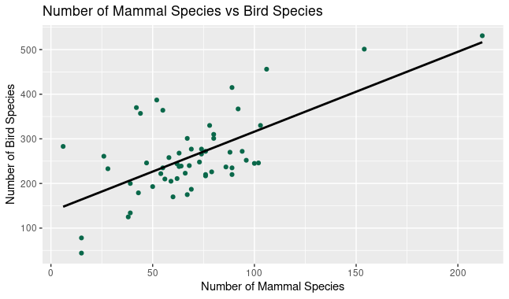
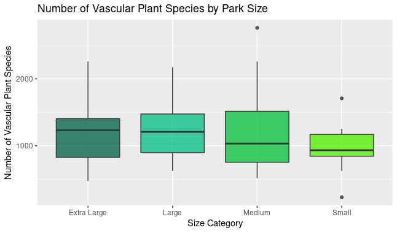

BIOS 611 Project 1 Proposal
===========================
Analysis of U.S. National Parks Biodiversity Datasets

Introduction
-----------------

The United States has 62 National Parks. Data on 56 of these parks was provided by the National Park Service. Because of the varying geography of the U.S., the parks vary greatly in terms of their biodiversity. Biodiversity refers to the variety and variability of species in an ecosystem. Biodiversity is important for maintaining healthy ecosystems. 

In this project, we will look at the amounts of different species and compare these amounts across the parks. For instance, which parks have more species of mammals? Which parks have more species of birds, plants or even algae? We will also evaluate the correlations and generate models to understand relationships between the numbers of different species. For example, does a greater number of vascular plant species predict a greater number of mammal species? 

We will develop and produce engaging figures to allow the user to understand our results. 

Datasets
-----------------

The datasets used are publicly available on Kaggle. They can be downloaded at: https://www.kaggle.com/nationalparkservice/park-biod

The datasets include information about each of the US National Parks, including park location and size as well as a catalog of species that reside in each park.  

Preliminary Figures
------------------

This figure shows a fairly strong positive correlation between the number of unique
mammal species and the number of unique bird species in the parks.

This figure shows the number of unique vascular plant species for each of the 4 park 
size categories. These categories were created based by dividing the parks into fourths
based on their acreages. The median number of unique vascular plant species increases
as the park size category increases.

Using This Project
-----------------

You will need Docker and you will need to be able to run Docker as your current user.

You'll need to first build the container:

    > docker build . -t project1-env
The Docker container is based on rocker/verse. To run rstudio server: 

    > docker run -v `pwd`:/home/rstudio - p 8787:8787 -e PASSWORD = 
    <yourpassword> -t project1-env
    
Then connect to the machine on port 8787.

Makefile 
-----------------

The Makefile is an excellent place to look to get a feel for the project.

To use the project go to the terminal in RStudio and type:
> make parks_report.pdf